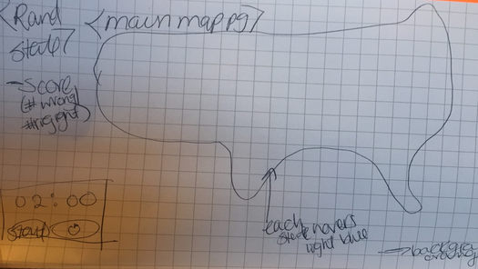

# 50 States Map Game

## How to Play the 50 States Map Game

* The object of the game is to correctly select on the map the U.S. state that will appear at random in as few guesses as possible
* The game begins when you click the "Start" button.  
* This will initiate the countdown clock.
* You will have 2 minutes to correctly guess 20 randomly selected U.S. States.
* You are allowed 5 wrong guesses. Once you reach your maximum incorrect guesses, the game is over and you lose.
* You will also lose if the countdown clock runs out and 2 minutes are up.
* A winner is determined if you are able to correctly select 20 states in under 2 minutes, with less than 5 wrong attempts.

## Technologies Used

* State Map with borders measured
* Countown clock
* Click event based on the state guessed 
* Conditional to check if border selection matches the state's ID
* Counter to track wrong attempts
* Function to call random object (state name) from array

## MVP

* Use an SVG map of the USA (state borders will be defined) 
* Randomly display contents of array
* Ensure SVG measurements have ID's to connect with array 
* Collect wrong answers & correct answers with visible counter
* Initiate countdown clock
* Animations on each right or wong selection

##Pseudo Code

* Connect each state to corresponding array with corresponding ID
* Randomly display state name from array
* Use if statement and event listener to check if correct state was selected (if random state === state clicked return correct else, return wrong)
* Implement counter to track wrong and right clicks
* Implement timer at start of game, counting down from 2 min
* Hide/Show Instructions Page, Map Container, Win Page, Lose Page
* Use if else statement to determine winner (if correct answer >= 20 you win else if wrong answer >=5 || click === 0 you lose)

## User Stories

* As a visitor, I want to access this game on the internet so I can practice learning where each state is located.
* As a visitor and non US citizen, I want to access this game so I can learn about each state within the United States.
* As a student, I want to be able to pinpoint quickly each state, and continue to play this game to stay fresh and retain the information.

##Wireframe (lol)

## Darn I wish I...../Reach Goalz
If I were better at coding, and had more time, I would have liked to change:
* A lot...
* I struggled with creating the random state from the list, then removing it from the list and assingning the new array to a variable.  My splice method was not functioning properly, so I had to change the win factor to if you correctly guess 20 states, rather than all 50 states.  Due to the lack of splicing, some states can be repeatedly asked. This was a last minute realization, and once I attempted the splice method - nearly all of my code broke.  
* I really wish that I could animate each state when selected - rather than the .decider div tag (Yee Yee || Nope sorry dood.) The SVG map was new and very cool to work with but also was difficult to format.
* I would have liked the player to be abe to enter their name at the beginning, as well as have the option to play the game with state capitals, and bonus questions specific to each state.  I think this would have made the game more challenging and engaging.
* I would have liked to use interactive tally marks each time a wrong guess was made.
* It would have been great to have the option to either play against the clock, or play with unlimited timing but fewer wrong attempts allowed.
* Overall, I wish I had more time to style the game and maybe add s

## It just keeps going

Shout outs:

* [Codepen](http://codepen.io/dtrane/pen/aNyaoV) for providing me with the coordinates of each state border, pixel by pixel- thank gawd.
* Heidi, who helped me get out of my funk and pull objects from my crazy long array
* Jared and Taylor who helped me with my star animations
* Justin who makes me feel better and convinced me to go salsa dancing on Wednesday (open invite yall)
* To Guillermo - my new roomate, who played la guitarra until 2am while I was debugging as much as possible. Gracias.

### Tools on tools on tools

[Jquery](http://jquery.com/), [Stack Overflow](http://stackoverflow.com/), [Animate CSS](https://daneden.github.io/animate.css/), [JS HINT](http://jshint.com/), , [MDN](https://developer.mozilla.org), [Trello](https://trello.com); [QuackIt](http://www.quackit.com/html/html_music_code.cfm)
